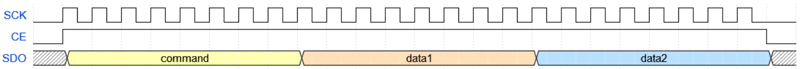
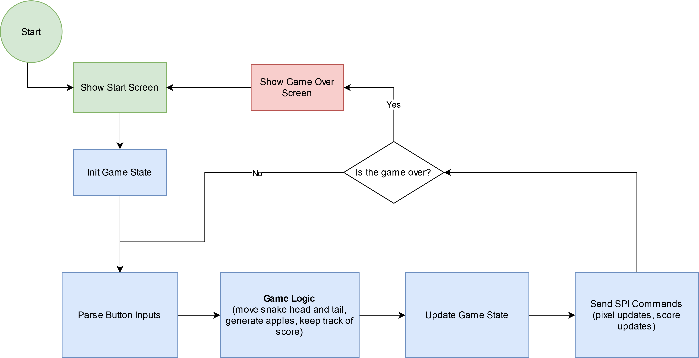
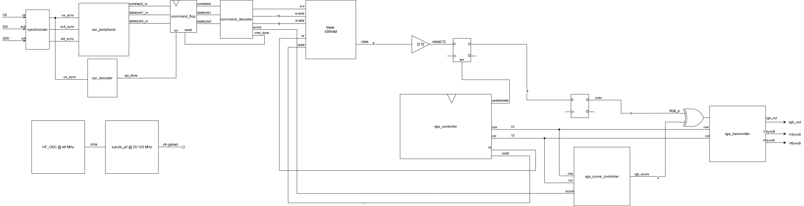

# Design Decisions
This project focused on using the VGA protocol at the industry standard 640x480 resolution at 60 Hz refresh rate. Holding RGB values for each pixel would require 3\*640\*480 = 921600 bits of memory, more than the FPGA can hold in flip flops or in RAM. Therefore, to mitigate this constraint, we partitioned the screen in 20 pixel square chunks, allowing us to use the onboard embedded block RAM on the FPGA. This results in a chunk resolution of 32 by 24. 

To minimize the data being sent from the MCU to the FPGA, the MCU only sends commands when pixels need to be updated. With this method, the screen does not have to be drawn from scratch every frame, saving precious computational power. This requires the FPGA to hold on to the values sent by the MCU. To accomplish this, the FPGA takes advantage of the onboard embedded block RAM. 

# MCU Design
The MCU in this design is responsible for handling user input, game logic, and display commands. User input is given through a set of four push buttons, which correspond to each direction the snake can move in. These buttons are tied to interrupts, allowing input to happen at any point during the calculations of game logic. This lets the inputs feel very responsive, as the input won't be missed due to polling at the wrong time. 

### SPI Communication Design
Communication between the FPGA and MCU is entirely controlled by the MCU, as the FPGA has no need to send data to the MCU. This communication is done over SPI with the following structure:

The command, data1, and data2 bytes follow the following table:

| Command | Hex Encoding | Data Byte 1 | Data Byte 2 |
| ------- | ------------ | ----------- | ----------- |
| Write Color Base Address | 0x80 | X Position | Y Position |
| Update Score | 0x10 | Score value MSBs | Score value LSBs |

To set a specific color with the Write Color Base Address command, the lowest 3 bytes of the command byte follow the following encoding:

| Lowest 3 bits of command | Color |
| ------------------------ | ----- |
| 0 | Black |
| 1 | Blue |
| 2 | Green |
| 3 | Cyan |
| 4 | Red |
| 5 | Purple |
| 6 | Yellow |
| 7 | White |

For example, to set the pixel chunk at (4,7) to red,
- command = 0x84
- data1 = 4
- data2 = 7

The update score command follows a similar structure, but no extra data is encoded in the command byte.

### Game Logic
The game logic implemented closely follows that of the classic snake game. That is to say, if the head of the tail runs into any part of the tail or the game borders, the game ends. Score is accumulated and snake tail is lengthened by eating the red "fruit". Go for as long as you can!

## MCU Block Diagram

# FPGA Design

The FPGA design consists of four main functional blocks:
- SPI Input and Decoder
- Memory 
- VGA Transmitter
- Score Decoder

All signals from the MCU to the FPGA are passed through synchronizers to avoid asynchronous behavior, especially when writing to the embedded block RAM which has a hold time constraint that needs to be obeyed. 

In addition, the VGA protocol for 640 x 480 @ 60 Hz is based off of a 25.175 MHz clock. To make timing match as closely as possible, the FPGA must use the same clock frequency to transmit pixels at the rate the monitor expects. To do this, the PLL module was instantiated using Radiant's IP generation functions. The frequency generated by the PLL was 25.125 MHz, which is within the tolerance on pixel clock frequency for this application of VGA. 

## SPI Input and Decoder

SPI inputs are decoded on the FPGA according to the specification listed in the [SPI Communication Design](#spi-communication-design) section. This consists of a controller that sends a trigger signal when the SPI chip select line drops from active to inactive. From here, SPI inputs are decoded and sent to their respective hardware. Pixel color write commands get sent to the RAM, while score update commands get sent to the score decoder hardware.

## Memory

Each 20 pixel wide chunk is stored in the RAM. For this use case, the RAM module used was 8 bits by 1024 entries. Since the address space for this is 10 bits, the x and y position of the pixel chunk can be encoded into an address with 5 bits each. In other words, the 5 most significant bits encode the y position of a chunk, and the 5 least significant bits encode the x position of a chunk. The lowest 3 bits in each memory location encoded the RGB values for that chunk.

To display the correct colors on the screen, the surrounding hardware has to fetch the color for the next chunk relative to the chunk the display is currently signaling.

### VGA Transmitter

These modules are responsible for pulsing the HSync and VSync lines, determining which RGB values to read in from memory, and transmitting all signals with the correct timing. This is accomplished with counters that keep track of which row and column is being sent out in a given frame. Importantly, it makes sure the porches (sections where no color data should be sent) are implemented properly in the VGA protocol.

### Score Decoder

These modules use the commands from SPI to display the score on the bottom right of the display. By using the current row and col values that the display is driving in a frame, it masks the RGB values to create a counter that resembles a seven segment display. In the spirit of MicroPs, the score is represented as a hexadecimal number. 

## FPGA Block Diagram

