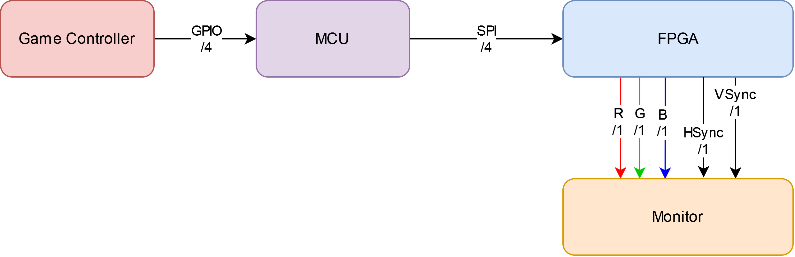

# Project Abstract
This is the project website for Kaitlin Lucio and Diego Herrera Vicioso's final project in E155 at HMC. 
Snake on VGA is a project designed to play around with video protocols while displaying a classic game.

# Project Motivation
This project was inspired by the look and feel of classic arcade-style games. We were interested in working on such a game,
but thought about what could make it interesting. So, the idea of displaying it on a regular, run-of-the-mill monitor (provided it has a VGA port, a less common protocol nowadays) was enticing. So we went for it!

# System Block Diagram

# Demo


# Acknowledgements
We would like to thank Profs. Brake and Smilkstein for their support this semester in MicroPs. Couldn't have done it without you both!

