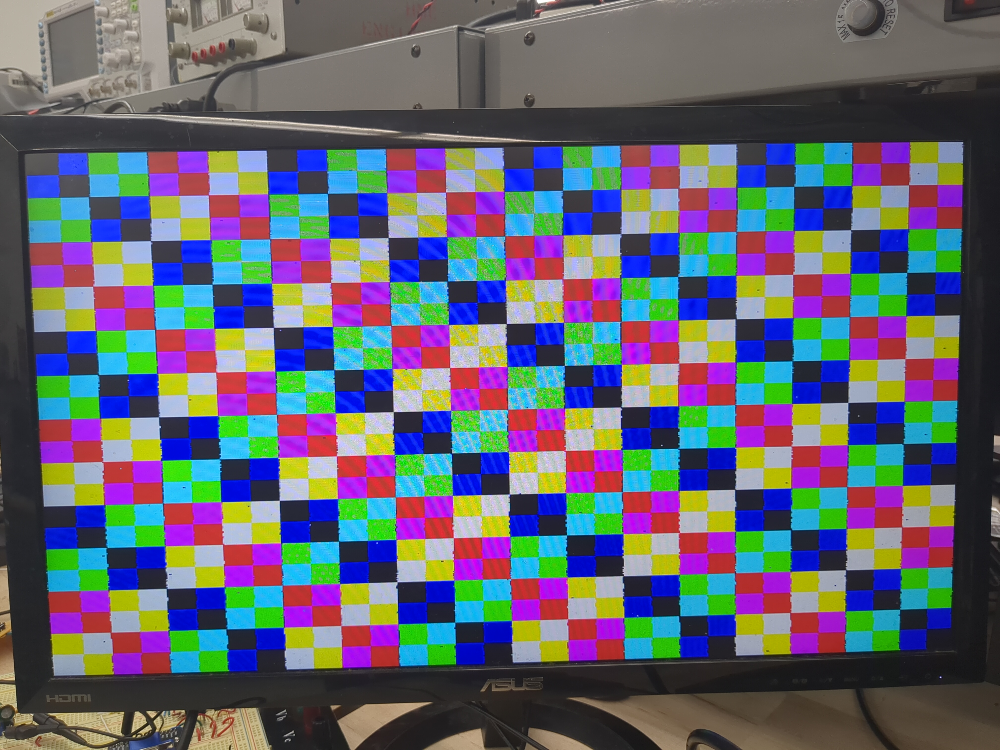

# Results
The specifications we set at the beginning of the project were:
1. FPGA is able to display frames on the monitor through a VGA connection
2. MCU is able to read input from the keypad and update the snake’s direction accordingly
3. MCU can send frames at a speed fast enough to update the monitor at 30 Hz.
4. Snake game logic matches the classic game

All specs were met at the end of the project, and some were even exceeded. The system is capable of displaying at 60 Hz rather than the 30 Hz in specification 3. Using one bit for each red, green, and blue field in each pixel yields 8 possible colors. A result from testing is shown below, where all 8 colors are displayed on the monitor in a fun pattern.

An interesting issue that we were unable to pin down was a "fuzziness" around the horizontal edges of chunks. We believe this to be some kind of off-by-one error in the VGA driver controller, but were unable to find the discrepancy based on timing the VGA signals outputted by the FPGA. There were no discrepancies between the timing standards defined in [1], but we still ran into this "fuzziness" problem. Nevertheless, the fuzziness does not affect the gameplay quality. 

